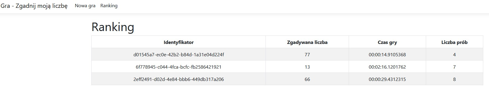

# Guess My Number

A RESTful ASP.NET Core Web Api. 


## API Reference

#### Gets start view

```http
  GET 
```


#### Initialize new game and genarete token with game Id and set it into cookie

```http
  GET /Game/Guess
```


#### Endpoint responsible for guessing the number for the game. Return guess result.

```http
  POST /Game/Guess
```

| Parameter | Type     | Description                       |
| :-------- | :------- | :-------------------------------- |
| `guess`   | `int`    | **Required**. Guess number        |


#### Gets high scores games

```http
  GET /Game/Highscores
```


## Screenshots

##### Start view


##### New game


##### Guess number too big


##### Guess number too low


##### Guess number - win


##### High scores



## Authors

- [@Bożena Mazur](https://www.github.com/b0zenka)

